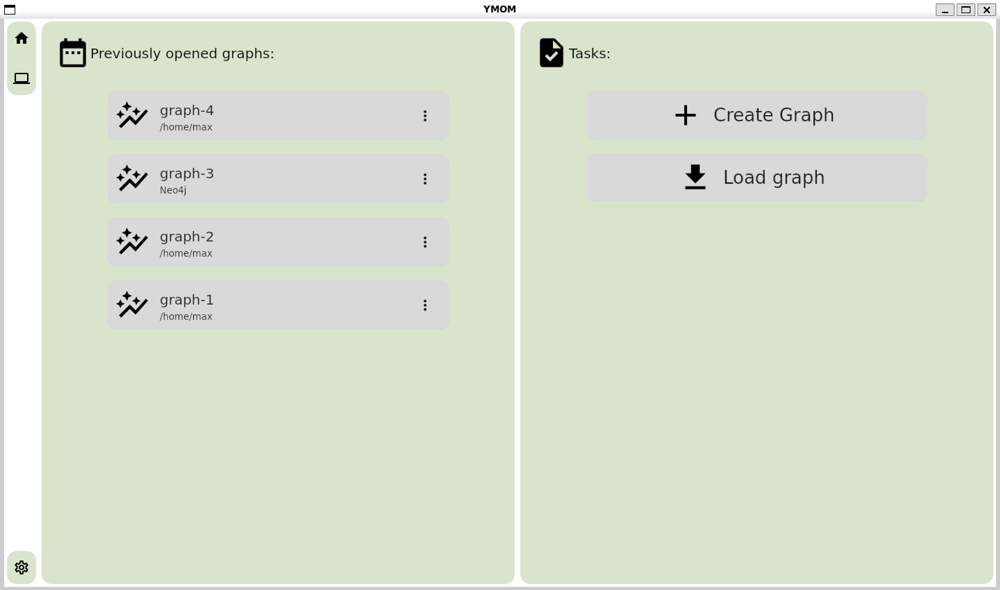
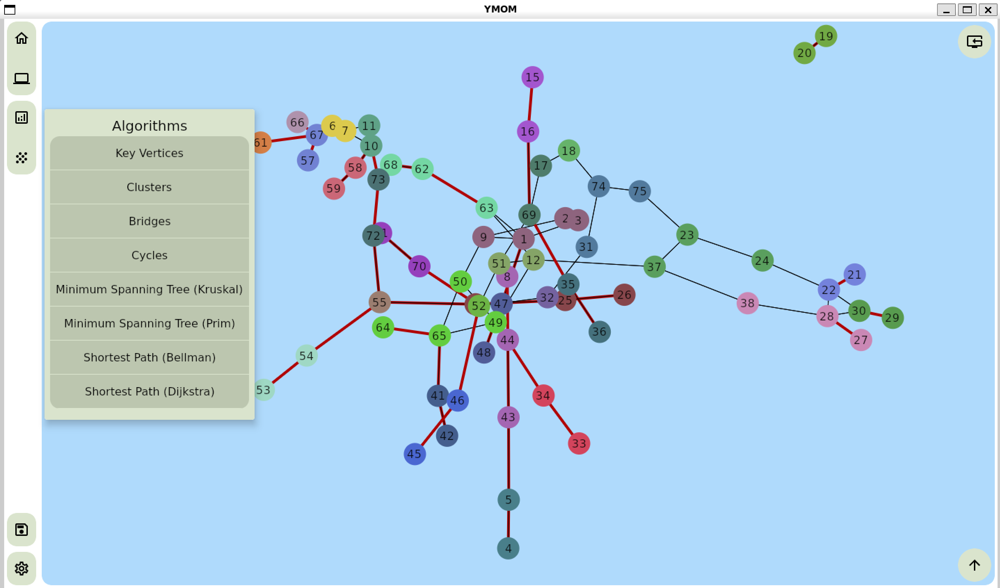
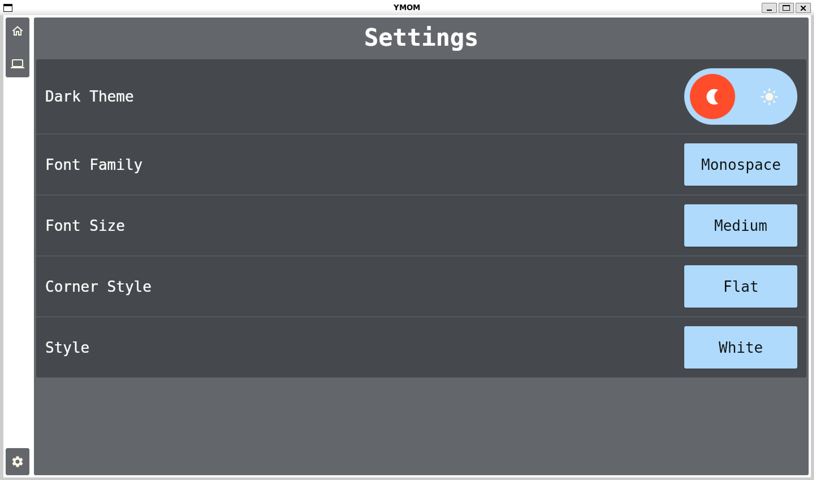
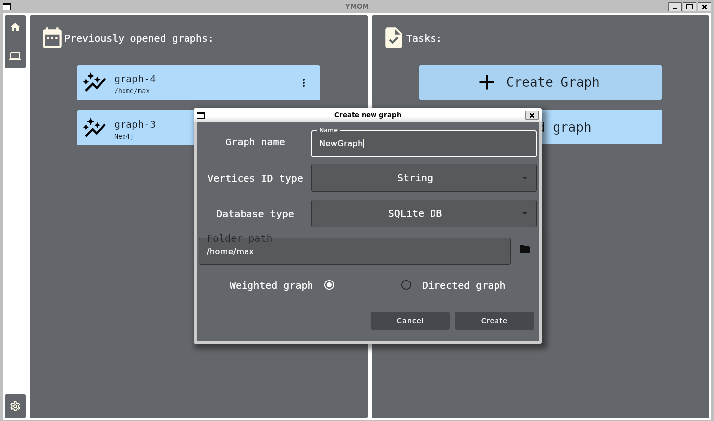

[//]: # (Project readme template from https://github.com/othneildrew/Best-README-Template/)
<a name="readme-top"></a>

[![Kotlin 1.9.23][kotlin_img]][kotlin_releases_url]
[![License][license_img]][repo_license_url]


<h1 align="left">Graph Visualizer</h1>

## Description

The `Graph Visualizer` provides a graphical user interface for visualizing graphs, analyzing them using a variety of
algorithms, and saving the results.

## Provided algorithms

### Basic algorithms

- [x] [ForceAtlas2](https://medialab.sciencespo.fr/publications/Jacomy_Heymann_Venturini-Force_Atlas2.pdf) - to lay out
  a graph on a plane
- [x] [LeaderRank](https://journals.plos.org/plosone/article?id=10.1371/journal.pone.0021202) - to highlight key
  vertices
- [x] [Louvain clustering method](https://en.wikipedia.org/wiki/Louvain_method) - to find communities

### Classical algorithms

- [x] [Tarjan's strongly connected components](https://www.geeksforgeeks.org/tarjan-algorithm-find-strongly-connected-components/)
- [x] [Tarjan's bridge-finding](https://en.wikipedia.org/wiki/Bridge_(graph_theory))
- [x] [Finding cycles for a given vertex](https://neerc.ifmo.ru/wiki/index.php?title=Использование_обхода_в_глубину_для_поиска_цикла)
- [x] [Kruskal's algorithm](https://en.wikipedia.org/wiki/Kruskal%27s_algorithm)
- [x] [Prim's algorithm](https://en.wikipedia.org/wiki/Prim%27s_algorithm)
- [x] [Dijkstra's algorithm](https://en.wikipedia.org/wiki/Dijkstra%27s_algorithm)
- [x] [Bellman-Ford algorithm](https://ru.wikipedia.org/wiki/Алгоритм_Беллмана_—_Форда)

## Saving graphs

The application provides tools for saving and loading graphs:

* file in `JSON` format
* `SQLite DB`
* `Neo4j DB`

## Chips and Features

* You can create edges in a graph in 2 ways:
    1) Swipe down in the vertex menu area, the edge menu will appear, in which you can create the required edge
       

    2) Click on the vertex you want to link and, while holding down the "Shift", click on the vertex you want to create
       an edge to

* | Icon "Save the Graph"                                                                                    | Icon "Reset the Graph"                                                                                     |
  |----------------------------------------------------------------------------------------------------------|------------------------------------------------------------------------------------------------------------|
  |  |  |

* When creating a graph with a database of the "Neo4j" type, you must specify the full link in the "Host" field, for
  example "bolt://localhost:7687"

## Getting started

To run building application execute command:

```bash
# Clone this repo
git clone https://github.com/spbu-coding-2023/graphs-graphs-12.git

# Build
./gradlew build

# Run 
./gradlew run
```

## Some Screenshots

| Main Screen                                                                            | Graph Page                                                                         |
|----------------------------------------------------------------------------------------|------------------------------------------------------------------------------------|
|  |  |

| Settings                                                                           | Create New Graph                                                                               |
|------------------------------------------------------------------------------------|------------------------------------------------------------------------------------------------|
|  |  |

## Authors

- [@IliaSuponeff](https://github.com/IliaSuponeff)
- [@RodionovMaxim05](https://github.com/RodionovMaxim05)
- [@Friend-zva](https://github.com/Friend-zva)

## License

Distributed under the [MIT License](https://choosealicense.com/licenses/mit/). See [`LICENSE`](LICENSE) for more
information.

<p align="right">(<a href="#readme-top">back to top</a>)</p>

<!-- Image links -->

[kotlin_img]: https://img.shields.io/badge/Kotlin-%201.9.23-magenta

[license_img]: https://img.shields.io/badge/License-MIT-green.svg

<!-- Inner Links -->

[repo_license_url]: https://github.com/spbu-coding-2023/graphs-graphs-12/blob/main/LICENSE

<!-- Outer Links -->

[kotlin_releases_url]: https://kotlinlang.org/docs/releases.html#release-details
